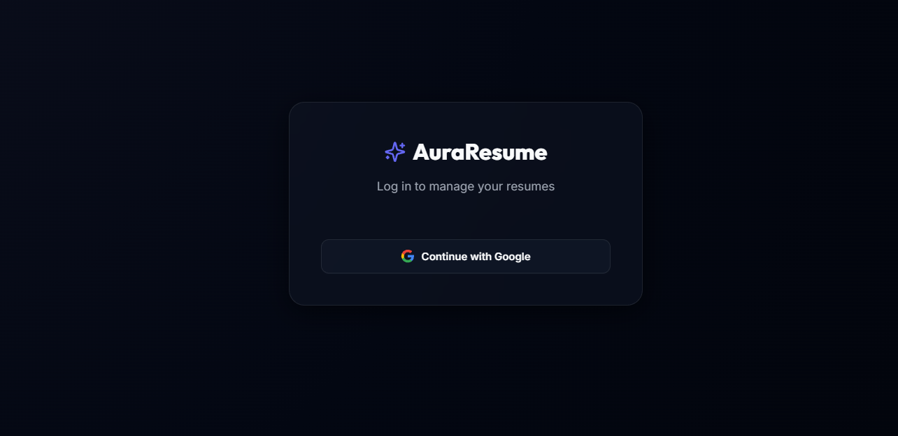
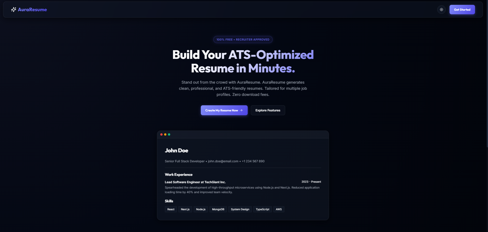
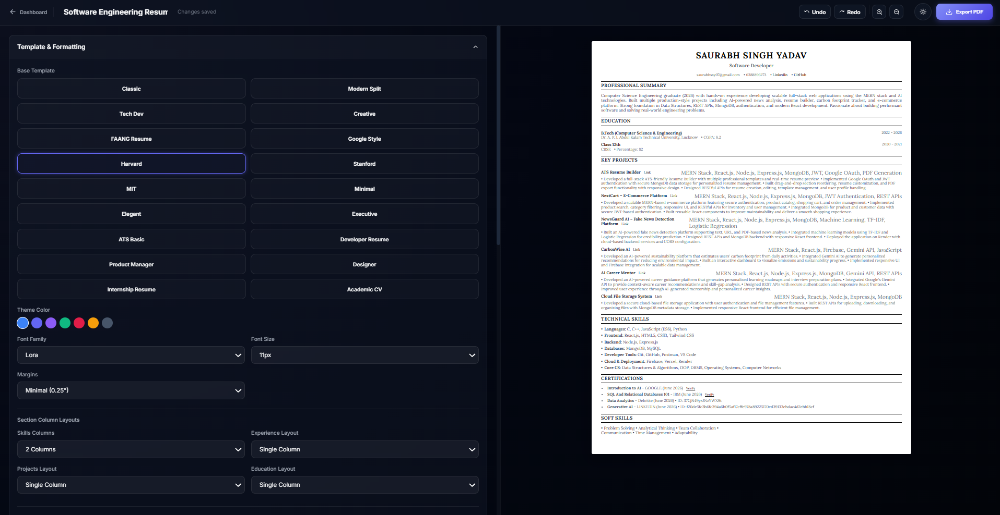
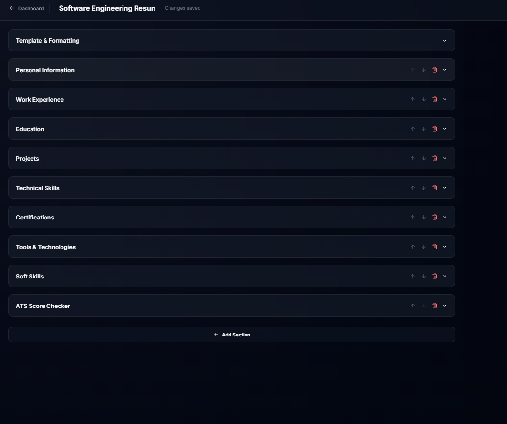
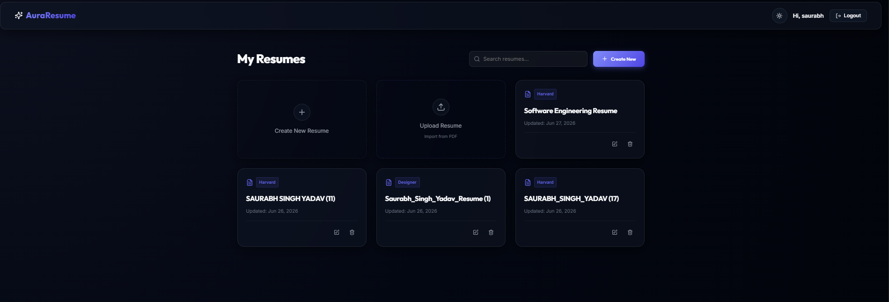
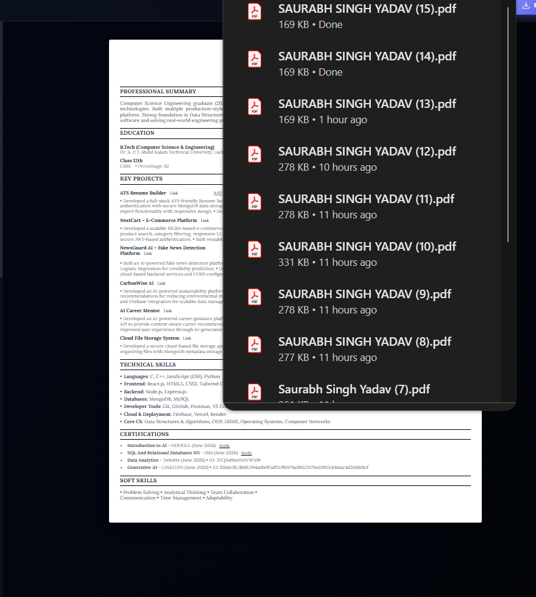

<div align="center">

# 📄 AuraResume

### Modern ATS-Friendly Resume Builder with Cloud PDF Export

[](https://nextjs.org/)
[](https://react.dev/)
[](https://firebase.google.com/)
[](https://www.mongodb.com/)
[](https://render.com/)
[](LICENSE)

A modern, full-stack resume builder that enables users to create professional, ATS-friendly resumes with real-time editing, secure cloud storage, and production-ready PDF export.

### 🌐 Live Demo

**https://auraresume-p31i.onrender.com**

</div>

---

# ✨ Why AuraResume?

Many online resume builders restrict downloads behind subscriptions or watermark exported resumes.

AuraResume was built to solve this by providing:

- ✅ Professional ATS-friendly resume templates
- ✅ Secure cloud storage
- ✅ Google Sign-In authentication
- ✅ Real-time editing
- ✅ Production-ready PDF generation
- ✅ Responsive design
- ✅ Modern developer-friendly architecture

---

# 📸 Screenshots

## 🔐 Login



---

## 📊 Dashboard



---

## ✍️ Resume Editor



---

## 👀 Resume Preview



---


## 👀  View



---


## 📄 Downloaded PDF



---

# 🚀 Features

### Resume Builder

- Live editing
- Auto-saving
- Dynamic resume sections
- Multiple resume sections
- Responsive interface

### Authentication

- Google Sign-In using Firebase
- Secure JWT Authentication
- Protected Routes

### Database

- MongoDB Atlas
- Persistent cloud storage
- Resume history

### PDF Export

- Production-ready server-side PDF generation
- Puppeteer-Core
- Sparticuz Chromium
- Print-ready formatting

### Deployment

- Render
- Environment variable support
- Cloud-optimized architecture

---

# 🏗 Project Architecture

```
                React Frontend
                      │
                      ▼
                Next.js App Router
                      │
      ┌───────────────┼───────────────┐
      ▼                               ▼
Firebase Authentication          API Routes
      │                               │
      ▼                               ▼
 Google Login                 MongoDB Atlas
                                      │
                                      ▼
                           Resume Data Storage
                                      │
                                      ▼
                         Puppeteer-Core + Chromium
                                      │
                                      ▼
                              Professional PDF
```

---

# 🛠 Tech Stack

| Frontend | Backend | Database | Authentication | PDF Engine | Deployment |
|----------|----------|----------|---------------|------------|------------|
| React 18 | Next.js 14 | MongoDB Atlas | Firebase Authentication | Puppeteer-Core + Sparticuz Chromium | Render |

---

# 📂 Folder Structure

```
AuraResume
│
├── app
│   ├── api
│   ├── editor
│   ├── preview
│   └── auth
│
├── components
│
├── lib
│
├── public
│
├── screenshots
│
├── README.md
│
└── package.json
```

---

# ⚙ Installation

## Clone Repository

```bash
git clone https://github.com/saurabhssy07-eng/AuraResume.git

cd AuraResume
```

Install dependencies

```bash
npm install
```

Run development server

```bash
npm run dev
```

Open

```
http://localhost:3000
```

---

# 🔑 Environment Variables

Create

```
.env.local
```

```
MONGODB_URI=

JWT_SECRET=

NEXT_PUBLIC_FIREBASE_API_KEY=

NEXT_PUBLIC_FIREBASE_AUTH_DOMAIN=

NEXT_PUBLIC_FIREBASE_PROJECT_ID=

NEXT_PUBLIC_FIREBASE_STORAGE_BUCKET=

NEXT_PUBLIC_FIREBASE_MESSAGING_SENDER_ID=

NEXT_PUBLIC_FIREBASE_APP_ID=
```

---

# 🌍 Deployment

AuraResume is optimized for deployment on **Render**.

Production PDF generation uses

- Puppeteer-Core
- Sparticuz Chromium

to ensure reliable PDF export in cloud environments.

---

# 🎯 Challenges Solved

One of the biggest challenges was enabling reliable PDF export in a cloud deployment.

This project uses:

- Puppeteer-Core
- Sparticuz Chromium

instead of the standard Puppeteer package to support serverless/cloud Linux environments.

Additional production issues solved:

- Firebase Authorized Domains
- MongoDB Atlas Authentication
- JWT Session Management
- Render Environment Variables
- Cloud PDF Rendering

---

# 🚀 Future Roadmap

- AI Resume Suggestions
- ATS Score Analyzer
- Cover Letter Generator
- Multiple Themes
- Resume Sharing
- Resume Analytics
- Resume Import
- DOCX Export
- AI Interview Preparation

---

# 👨💻 Developer

**Saurabh Singh Yadav**

Computer Science Engineer

Full Stack Developer

GitHub

https://github.com/saurabhssy07-eng

LinkedIn

https://linkedin.com/in/saurabh-singh-yadav-b23252361

---

# 📜 License

This project is licensed under the MIT License.

---

## ⭐ If you found this project useful, consider giving it a Star!
